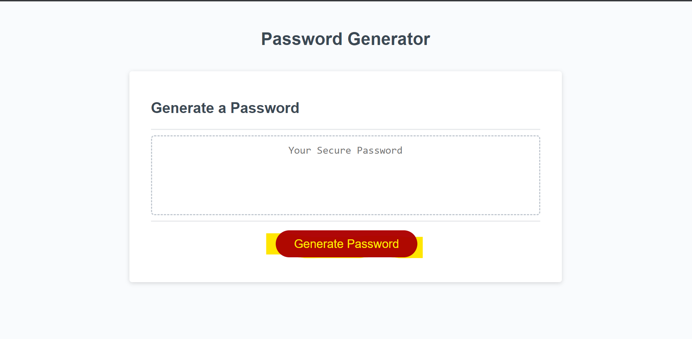

# <Password Generator Homework Challenge>

## Description

My motivation making this project was getting to know javascript better. I built this project to make a custom password generator. The problem that it solves is making secure passwords. I learned how to make for loops and functions. 
## Table of Contents (Optional)

- [Installation](#installation)
- [Usage](#usage)
- [Credits](#credits)
- [License](#license)

## Installation

- Navigate to the website of my Github profile: https://github.com/mikorod622/Password_Generator_Challenge
- Click the "<> Code" icon
- Click "Download ZIP"

## Usage

click the generate password button to be meeted with several prompts regarding the generated password

## Credits

- README template provided by: https://coding-boot-camp.github.io/full-stack/github/professional-readme-guide

## Badges

## Features
This is the site in a normal desktop browser

After clicking generate password you are prompted to make the parameters for your new password

---

Link to website: https://mikorod622.github.io/Password_Generator_Challenge/